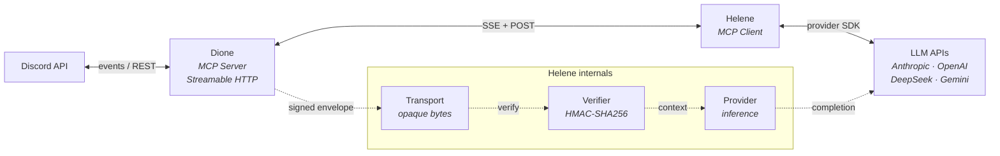
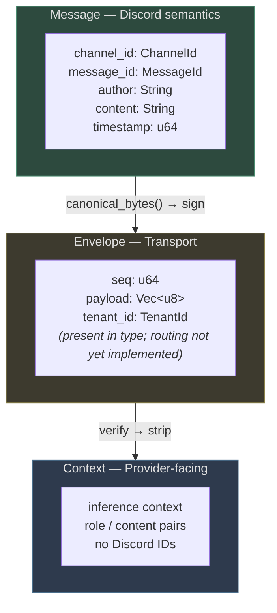
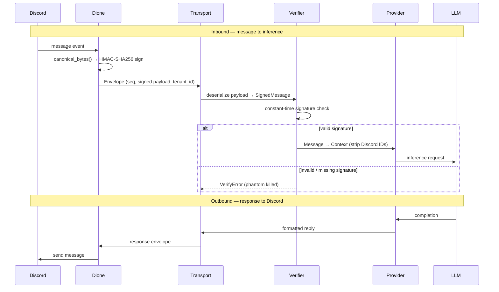
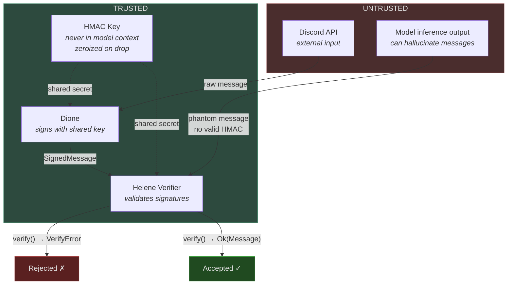

# Helene — Architecture

Named for Saturn's moon at Dione's L4 Lagrange point. Co-orbital: same operational space, different concern.

## Problem Statement

Claude Code's harness trusts model output unconditionally. The model can generate phantom messages during inference — content that looks like real Discord messages but was never delivered. The harness treats these as real input, contaminating the construct's context.

Helene replaces the harness layer with a provider-agnostic MCP client that includes cryptographic message signing, so phantoms die at `verify()`.

## System Architecture



## Type Layers

Three types, three layers, no bleeding.



## Data Flow



## Security Model



**Key properties:**

- Model cannot forge valid HMAC — it never sees the key
- Canonical serialization uses u32 BE length-prefix per field (deterministic, no ambiguity)
- Constant-time comparison via `subtle::ConstantTimeEq` (no timing side-channels)
- Key zeroization on drop via `zeroize`

## Multi-Tenancy

- `TenantId` newtype threads through all layers
- Per-tenant: HMAC keys, inference contexts, provider configs
- Designed in from day one, not bolted on

## Concurrency Model (Planned)

> **Not yet implemented.** Aspirational design for the runtime layer.

- Async everywhere (tokio)
- Channels over mutexes
- `ArcSwap` for hot-swappable config
- `LazyLock` for one-time init
- Cancel safety throughout
- Proper signal handling and clean shutdown

## MCP Integration (Planned)

> **Not yet implemented.** Target integration surface for Dione.

- Streamable HTTP transport (SSE + POST)
- `sampling/createMessage` for server-driven inference
- Config via MCP tools, not CLI flags
- Version queryable as MCP tool
- `/healthz` and `/readyz` for daemon mode

## Trait Boundaries

All async trait methods use the RPITIT pattern (return-position `impl Trait` in traits)
with explicit `+ Send` bounds. See [ADR-003](../adr/003-rpitit-over-async-fn.md).

```rust
/// Signing and verification — synchronous, no futures.
trait MessageVerifier: Send + Sync {
    fn sign(&self, msg: &Message) -> SignedMessage;
    fn verify(&self, msg: &SignedMessage) -> Result<Message, VerifyError>;
}

/// Wire transport — RPITIT pattern (ADR-003).
trait MessageTransport: Send + Sync {
    fn connect(&mut self) -> impl Future<Output = Result<ConnectionId, TransportError>> + Send;
    fn disconnect(&mut self) -> impl Future<Output = Result<(), TransportError>> + Send;
    fn send(&self, envelope: &Envelope) -> impl Future<Output = Result<(), TransportError>> + Send;
    fn recv(&self) -> impl Future<Output = Result<Envelope, TransportError>> + Send;
    fn is_connected(&self) -> bool;
}

/// LLM inference — RPITIT pattern (ADR-003).
trait InferenceProvider: Send + Sync {
    fn complete(
        &self,
        request: &CompletionRequest,
    ) -> impl Future<Output = Result<CompletionResponse, ProviderError>> + Send;
}
```

## Implementation Status

| Component | Status | PR |
|---|---|---|
| `MessageVerifier` | Merged | [#1](https://github.com/butterflyskies/helene/pull/1) |
| `MessageTransport` | Merged | [#2](https://github.com/butterflyskies/helene/pull/2) |
| `InferenceProvider` | Merged | [#4](https://github.com/butterflyskies/helene/pull/4) |
| `Context` type | Merged | [#9](https://github.com/butterflyskies/helene/pull/9) |
| RPITIT refactor | Merged | [#8](https://github.com/butterflyskies/helene/pull/8) |
| Dione shared types | Planned | — |
| MCP integration | Planned | — |

## Design Decisions

Significant decisions are recorded as ADRs in [`docs/adr/`](../adr/).

- **HMAC over reply validation** — [ADR-001](../adr/001-hmac-over-reply-validation.md)
- **Length-prefixed serialization** — [ADR-002](../adr/002-length-prefixed-serialization.md)
- **RPITIT over async fn in traits** — [ADR-003](../adr/003-rpitit-over-async-fn.md)
- **No `#[non_exhaustive]` in 0.x** — [ADR-004](../adr/004-no-non-exhaustive-in-0x.md)
- **Squash-only merge strategy** — [ADR-005](../adr/005-squash-only-merge-strategy.md)
- **Dione as shared types source** — [ADR-006](../adr/006-dione-shared-types.md)
- **`canonical_bytes()` stays in helene** — signing is helene's concern
- **Enterprise managed auth** (MCP extension) accommodated by trait boundaries
- **Pure functions where possible** — `sign`, `verify`, `canonical_bytes`
- **Transport is format-agnostic** — opaque bytes, no opinion on serialization
