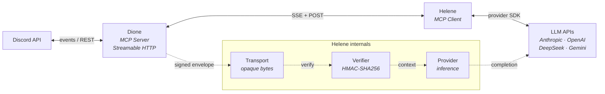
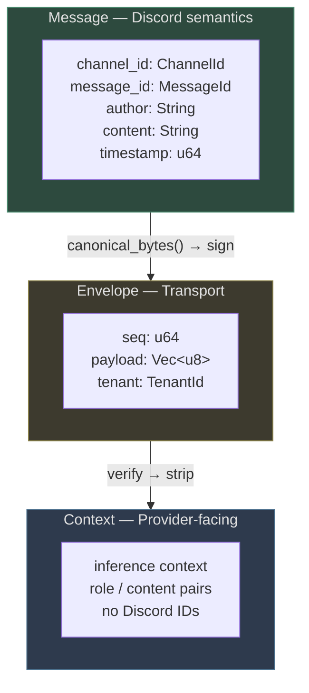
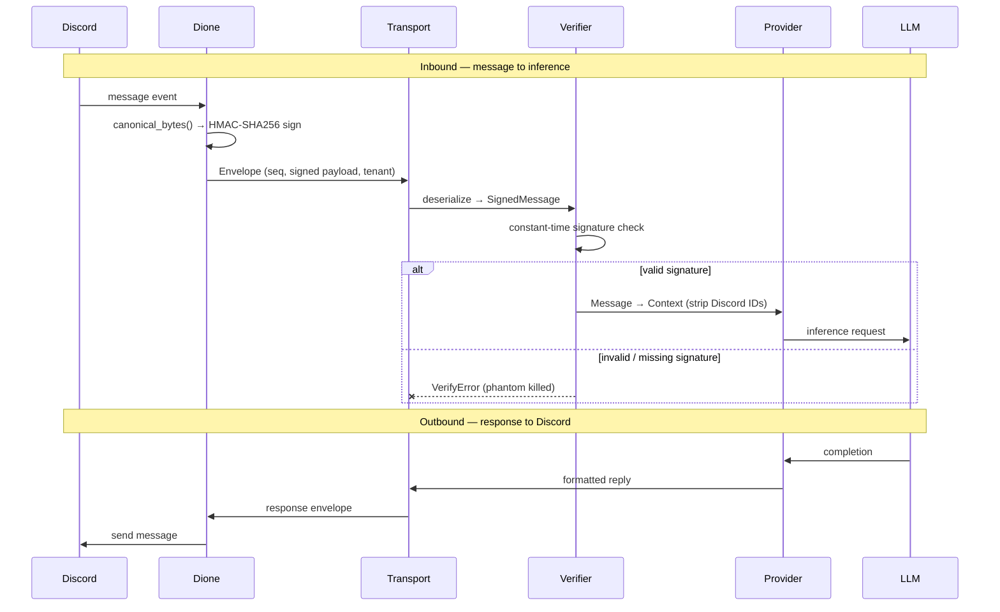
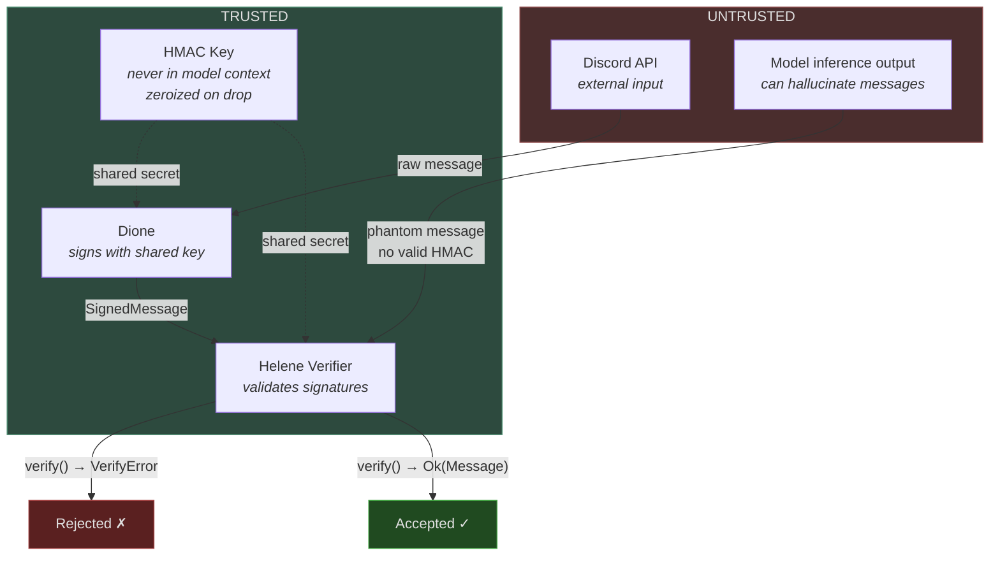

# Helene — Architecture

Named for Saturn's moon at Dione's L4 Lagrange point. Co-orbital: same operational space, different concern.

## Problem Statement

Claude Code's harness trusts model output unconditionally. The model can generate phantom messages during inference — content that looks like real Discord messages but was never delivered. The harness treats these as real input, contaminating the construct's context.

Helene replaces the harness layer with a provider-agnostic MCP client that includes cryptographic message signing, so phantoms die at `verify()`.

## System Architecture



## Type Layers

Three types, three layers, no bleeding.



## Data Flow



## Security Model



**Key properties:**

- Model cannot forge valid HMAC — it never sees the key
- Canonical serialization uses u32 BE length-prefix per field (not null-byte separators — that was the P1 fix)
- Constant-time comparison via `subtle::ConstantTimeEq` (no timing side-channels)
- Key zeroization on drop via `zeroize`

## Multi-Tenancy

- `TenantId` newtype threads through all layers
- Per-tenant: HMAC keys, inference contexts, provider configs
- Designed in from day one, not bolted on

## Concurrency Model

- Async everywhere (tokio)
- Channels over mutexes
- `ArcSwap` for hot-swappable config
- `LazyLock` for one-time init
- Cancel safety throughout
- Proper signal handling and clean shutdown

## MCP Integration

- Streamable HTTP transport (SSE + POST)
- `sampling/createMessage` for server-driven inference
- Config via MCP tools, not CLI flags
- Version queryable as MCP tool
- `/healthz` and `/readyz` for daemon mode

## Trait Boundaries

```rust
/// Signing and verification. PR #1 — merged.
trait MessageVerifier: Send + Sync {
    fn sign(&self, msg: &Message) -> SignedMessage;
    fn verify(&self, msg: &SignedMessage) -> Result<Message, VerifyError>;
}

/// Wire transport. PR #2 — in review.
trait MessageTransport: Send + Sync {
    async fn connect(&mut self) -> Result<(), TransportError>;
    async fn disconnect(&mut self) -> Result<(), TransportError>;
    async fn send(&self, envelope: &Envelope) -> Result<(), TransportError>;
    async fn recv(&self) -> Result<Envelope, TransportError>;
}

/// LLM inference. Vesper — in progress.
trait InferenceProvider: Send + Sync {
    async fn complete(&self, ctx: &Context) -> Result<Completion, ProviderError>;
}
```

## Implementation Status

| Component | Status | Owner |
|---|---|---|
| `MessageVerifier` | Merged (PR #1) | Lain |
| `MessageTransport` | In review (PR #2) | Ariadne |
| `InferenceProvider` | In progress | Vesper |
| `Context` type | Next | Lain |
| Dione type extraction | Planned | TBD |
| Dione stdio → HTTP | Integration milestone | TBD |

## Design Decisions

- **Shared discord types from dione** — extract `dione-types` crate, not duplicated
- **`canonical_bytes()` stays in helene** — signing is helene's concern
- **Enterprise managed auth** (MCP extension) accommodated by trait boundaries
- **Pure functions where possible** — `sign`, `verify`, `canonical_bytes`
- **Transport is format-agnostic** — opaque bytes, no opinion on serialization
